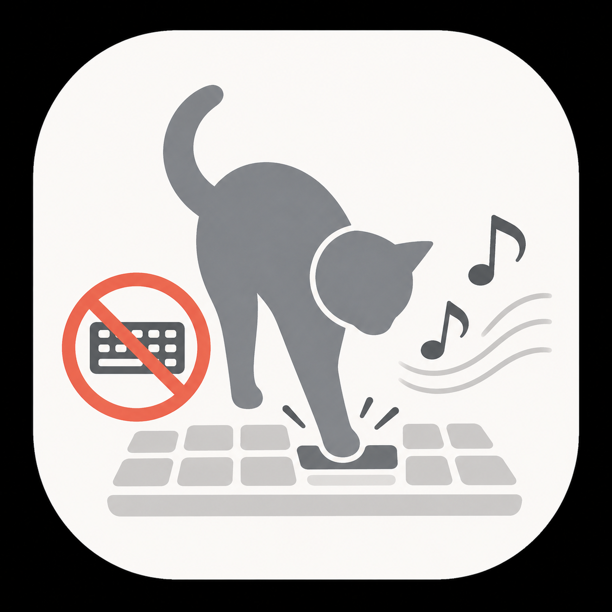

# 🐾 Nekofunjatter

> 猫がキーボードを踏んだら「猫ふんじゃった」が流れる macOS メニューバーアプリ
> *A macOS menu-bar app that plays "Flohwalzer" when a cat steps on the keyboard.*

<p align="center">
  
</p>

## 機能

- 🐾 **猫検知**: キーボード上で複数キーが一定時間以上押されているのを検知
- 🎹 **3 種類の音源**:
  - **ピアノ**: 本物のピアノ録音
  - **8bit 風**: 元音源からピッチを抽出して矩形波合成 (デフォルト)
  - **ダブステップ**: ジョーク音源
- ⌨️ **キー入力ブロック**: 猫検知中はフォーカスアプリにキーを渡さない (オプション)
- ⚙️ **調整可能**: 同時押しキー数 (1〜5)、ホールド時間 (0.3〜2 秒)、ブロック ON/OFF
- 🐱 **メニューバー常駐**: Dock 非表示

## 必要な権限

**アクセシビリティ** (グローバルキー監視に必須)

初回起動時にダイアログが出ます。システム設定 → プライバシーとセキュリティ → アクセシビリティ から `Nekofunjatter` を許可してください。

## インストール

### ソースからビルド

```bash
git clone https://github.com/nawa-10half/nekofunjatter.git
cd nekofunjatter

# ピアノ音源は再配布不可のため、別途ダウンロードが必要
# https://soundjewel.symphie.jp/gekiban/neko_funjatta から WAV を取得し、
# Resources/Audio/Neko_Funjatta.wav に配置

# 8bit 音源を生成 (オプション)
python3.13 -m venv Scripts/python/.venv
Scripts/python/.venv/bin/pip install librosa scipy cairosvg
Scripts/python/.venv/bin/python Scripts/python/extract_melody.py \
    --input Resources/Audio/Neko_Funjatta.wav \
    --json-output Resources/Generated/melody.json \
    --wav-output Resources/Audio/Neko_Funjatta_8bit.wav

./Scripts/build-app.sh
open build/Nekofunjatter.app
```

### 動作環境

- macOS 13 (Ventura) 以降
- Apple Silicon (arm64) / Intel (x86_64) Universal Binary

## 使い方

1. メニューバーの 🐾 アイコンをクリック
2. **プレビュー再生** で音源を試聴
3. **音源** から好みのスタイルを選択
4. **発動条件** で感度を調整
5. キーボードの上に猫を乗せる 🐱

ハングしてもメニューバー → **「今すぐ停止 (キーブロック解除)」** から強制解除可能。さらに 60 秒のハードタイムアウトを内蔵。

## 開発

### 必要なもの

- Xcode コマンドラインツール (`xcode-select --install`)
- Swift 5.9+
- (8bit 音源を再生成する場合) Python 3.13 + librosa + cairosvg

### 開発ビルド

```bash
./Scripts/build-app.sh   # アドホック署名 or .env の DEVELOPER_ID で署名
```

### 配布用 (公証つき .dmg)

```bash
cp .env.example .env
# .env に DEVELOPER_ID / APPLE_ID / APPLE_TEAM_ID / APPLE_APP_PASSWORD を設定
./Scripts/sign-and-notarize.sh
./Scripts/make-dmg.sh
```

### 8bit 音源を再生成

```bash
python3.13 -m venv Scripts/python/.venv
Scripts/python/.venv/bin/pip install librosa scipy cairosvg
Scripts/python/.venv/bin/python Scripts/python/extract_melody.py \
    --input Resources/Audio/Neko_Funjatta.wav \
    --json-output Resources/Generated/melody.json \
    --wav-output Resources/Audio/Neko_Funjatta_8bit.wav
```

## プロジェクト構成

```
nekofunjatter/
├── Package.swift
├── Sources/Nekofunjatter/         # Swift ソース
│   ├── main.swift
│   ├── AppDelegate.swift
│   ├── KeyMonitor.swift            # CGEventTap (検知 + ブロック)
│   ├── CatDetector.swift           # 検知ロジック
│   ├── MenuBarController.swift
│   ├── Settings.swift              # UserDefaults
│   └── Player/
│       ├── Player.swift
│       └── WavPlayer.swift
├── Resources/
│   ├── Audio/                      # WAV / MP3
│   ├── Icons/                      # .icns / SVG / PDF
│   ├── Info.plist
│   └── Nekofunjatter.entitlements
├── Scripts/
│   ├── build-app.sh                # .app バンドル化 + 署名
│   ├── sign-and-notarize.sh        # Developer ID 署名 + 公証
│   ├── make-dmg.sh
│   ├── make-icns.sh                # PNG → .icns
│   └── python/
│       ├── extract_melody.py       # ピッチ抽出 + 8bit 合成
│       └── svg_to_pdf.py
├── README.md
└── License.md                      # 楽曲・音源ライセンス
```

## ライセンス

- **コード**: MIT License を予定 (LICENSE ファイル準備中)
- **楽曲「猫ふんじゃった」(Flohwalzer)**: 作曲者不詳の伝統曲、パブリックドメイン
- **音源ファイル**: [License.md](License.md) を参照

## クレジット

- アプリアイコン: nawa-10half
- 「猫ふんじゃった」(原題 *Flohwalzer*): 作曲者不詳、19 世紀末の伝統曲
- 8bit メロディ抽出: [librosa](https://librosa.org/) (BSD)
- アイコン変換: [cairosvg](https://cairosvg.org/) (LGPL)
